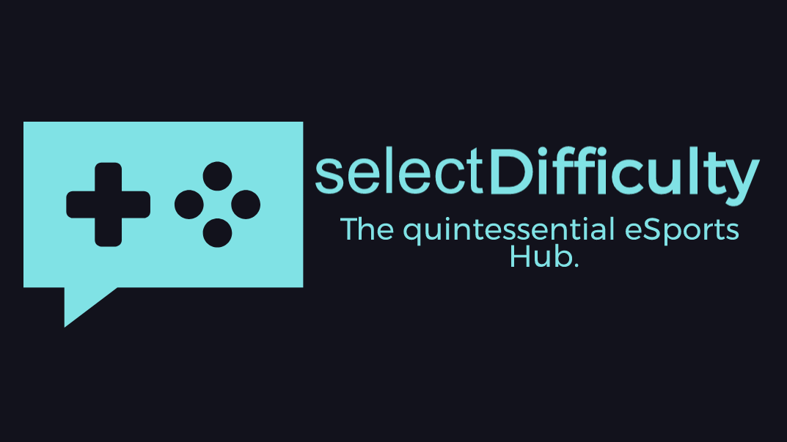
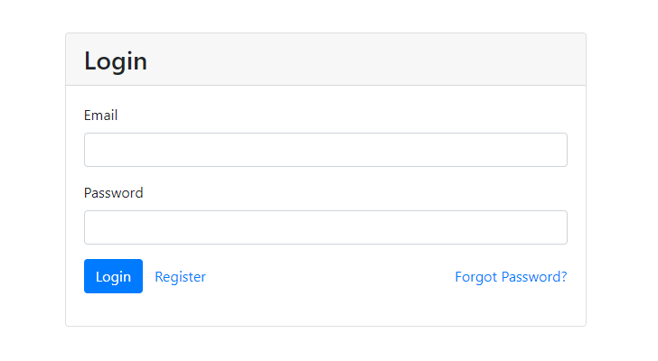
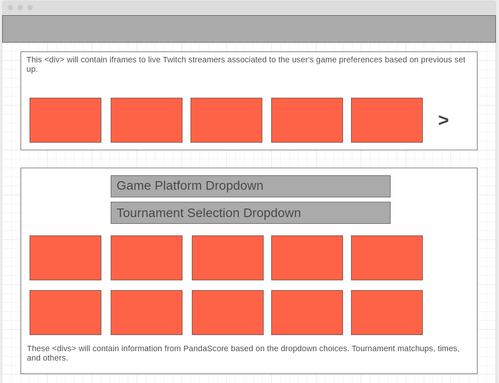
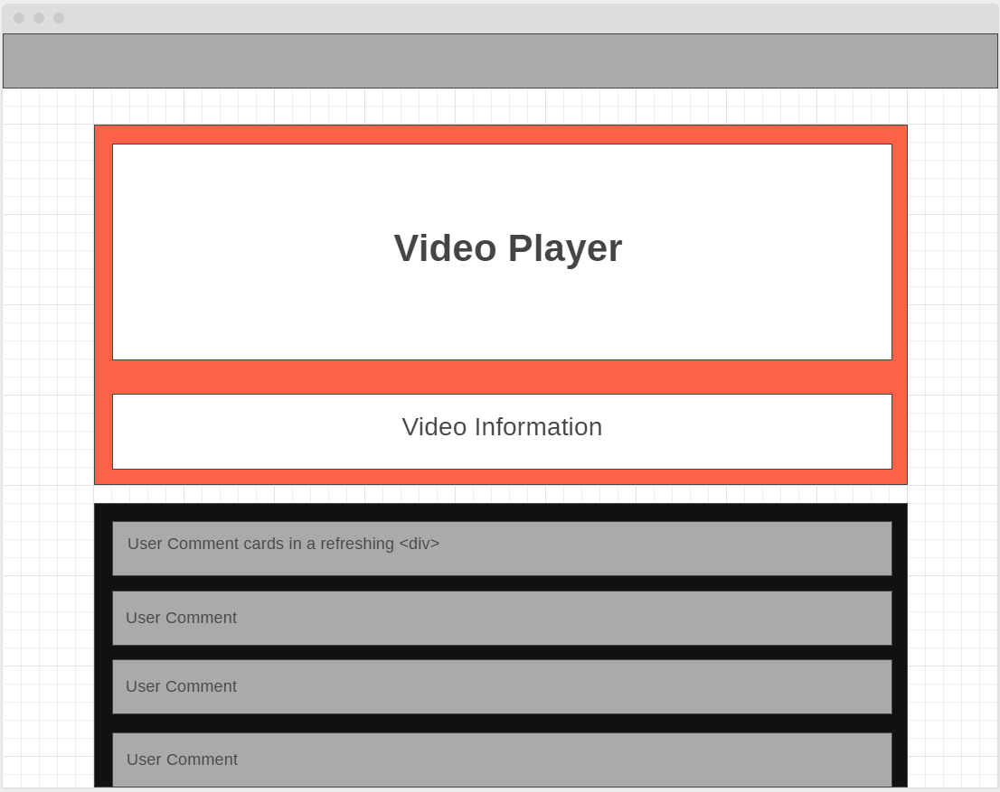

# SelectDifficulty V2

  
  
## Table of Contents

* [Description](#Description)  
* [Screenshots](#Screenshots)  
* [Creators](#Creators)  
* [Contact](#Contact)  
* [Build](#Build)  
* [License](#License)  

#### Created On: 10/03/2020  
​  
## Description
SelectDifficulty V2 aims to improve on its first iteration, which was a mobile-friendly website tailored to both avid eSports fans as well as beginner fans who are open to being introduced to the world of competitive video gaming. Beginners can come to learn by watching gaming personalities, and be immersed in the competitive nature of major tournaments.  

Version two is taking the original product from being a front-end-only application built with HTML, CSS, Bulma CDN, and JavaScript (and jQuery), to utilizing the full-stack of technology we have learned through the 2U Coding Bootcamp administered by George Washington University. The new technologies to be used include, but are not limited to, Express, MongoDB, Node.js, JWTs, React.js, and Heroku Deployment. New features and functionality will include account creation, personalized dashboards, and video and tournament comment boards.

## Screenshots
#### Login  
  
The first build will require account creation and user authentication. Many different platforms and games have eSports variants, and users will set their preferences upon account creation to influence their dashboard upon logging in.  

#### Dashboard  
​  
Simplifying the first version of SelectDifficulty to one page that shows the sections containing information that will be pulled from Twitch and PandaScore APIs. Clicking a video or tournament card will take you to a new feature.  

#### Topic  
​  
Each card will render a page specific to the stream or event. The main feature of this page will be a comment system that refreshes upon each new comment. This is to promote community and interaction among users.  
​
## Creators
Matt Wieciech- html/css/js/Twitch API  
Murad Alkaylanie - html/css/js/PandaScore API  
Jason Cruz- html/css/js/Bulma CDN/js/Presentation  

## Contact
​
https://github.com/wheaties5588  
https://github.com/Kaylan83  
https://github.com/WRXjasonSTI  
​
## Build
​
Javascript/jQuery  
HTML5  
CSS  
Bulma CDN  
PandaScore API  
Twitch API  
Moment.js  

## License
​
Copyright(c) 2020 By Team SD
​
This software is licensed under MIT license.